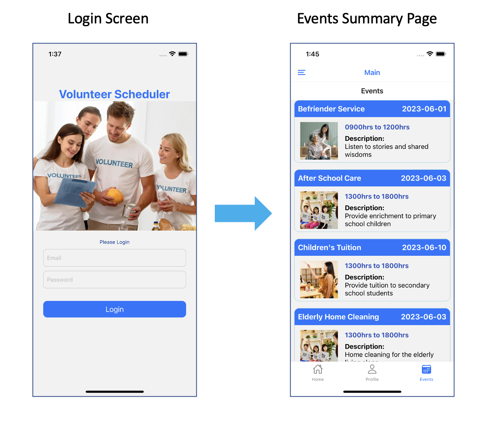
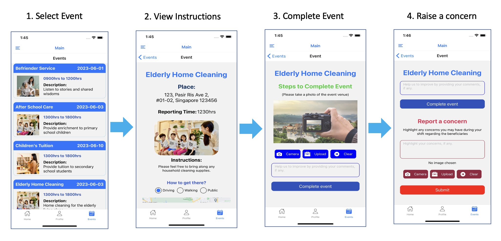
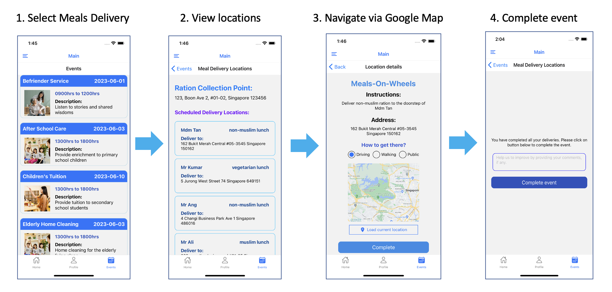
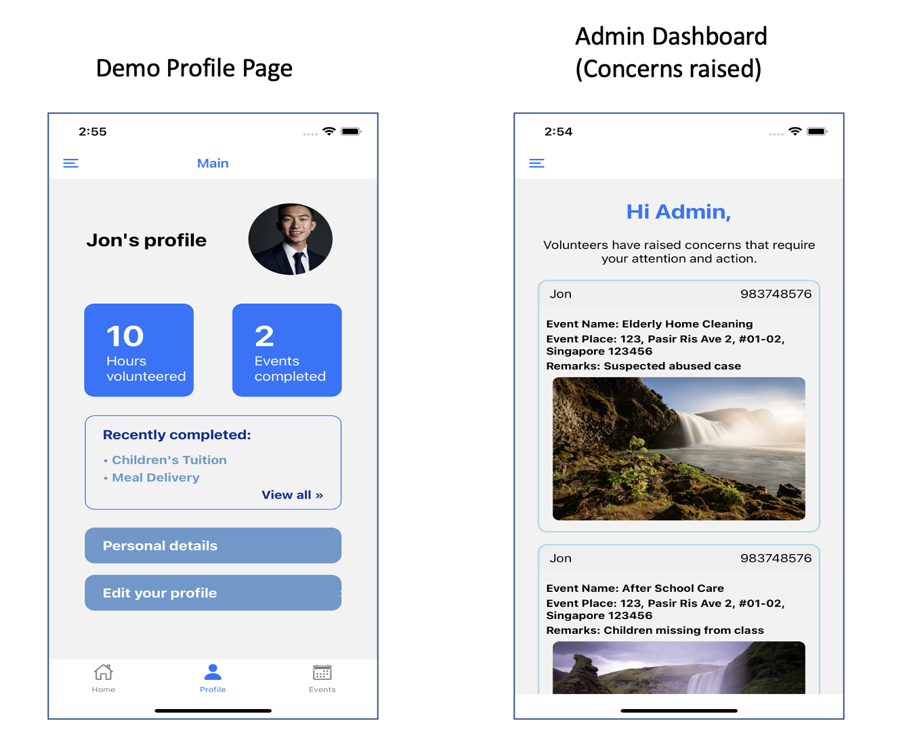

## Meals Delivery and Event Tracking App (For volunteer Services)
### Description
1. A react native (prototype) application designed to help charity organisations keep track of its events and completion statuses. 
2. Volunteers could use the app to monitor upcoming events and update status of events, as well as to submit alerts in realtime on critical issues concerning the beneficiaries (i.e. an elderly feeling unwell, suspected abuse cases and etc).
3. The charity organization will in turn be able to automate tracking of events as well as receive real-time feedbacks directly from the volunteers and to send immediate assistance, if neccessary. 

### Technology used
1. Javascript
2. React Native with Expo
3. Expo-image-picker
4. React-native-maps
5. Expo-web-browser
6. Expo-location
7. Google Maps API

### Data / Resource
Mock data stored in JSON format are used to demo the application. 

### User story of a volunteer
Volunteer will be able to:
1. login and view list of events assigned to him/her.
2. click into each event to view reporting instructions.
3. get current GPS coordinates and navigate to the event location using google map.
4. update completion status, along with photo attachments or comments, if any.
5. submit real-time alerts to highlight any areas of concern to the charity organization (i.e. elderly unwell, suspected abused cases)

### User story of a charity organisation
An administrator or a staff will be able to: 
1. login and view list of events that are currently on-going
2. view list of alerts and feedback submitted by volunteers in real-time

### Login Process

### Process Flow for Single Event

### Process Flow for Meals-on-wheels Event with multiple locations

### Misc Screenshots

